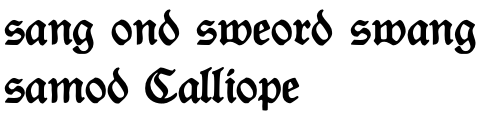
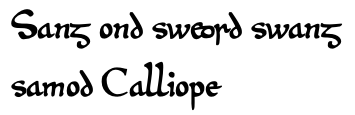

## Inscribing a sword

Inspired by [Nicole Coenen's videos](https://www.youtube.com/watch?v=dJhtDEuTvqo), I've been obsessing about having
a [Viking woodsplitting sword](https://vikingwoodsplitter.com/) made for me.
I mean, what woman _doesn't_ need a 4-foot sword to chop her wood?

Like every good sword, it needs an inscription. So I thought: why not use my Beodata model to produce some possible
names? I started out by
prompting this:

```claude-code
❯ use the beodata tooling to synthesize kennings or poetic lines describing
Calliope's sword and her bravery. Calliope is me, not a character in
Beowulf. Give me 20 alternative lines.
```

### Claude's Response

```claude

 ▐▛███▜▌   Claude Code v2.1.49
▝▜█████▛▘  Opus 4.6 · Claude Max
  ▘▘ ▝▝    ~/dev/beodata

⏺ Let me dig into the source material for sword kennings, bravery vocabulary,
  and poetic patterns.

... many tool uses later ...

⏺ Here are 20 lines, built from attested Beowulfian vocabulary and kenning
  patterns. Each pairs an OE line with a translation and source notes.

  ---
  Kennings for Calliope's Sword

  1. Calliopes hildeleóma, heardes méces ecg
  Calliope's battle-light, the hard blade's edge
  — hilde-leóma "battle-ray" = sword (Beo. 1143); méces ecge (Beo. 1812)
  2. Biter ond beaduscearp, bil scíre líxte
  Bitter and battle-sharp, the bill shone brightly
  — bil (Beo. 1557); líxte se léoma (Beo. 1570)
  3. Gúðsweord geatolíc, gíganta geweorc
  A stately war-sword, the work of giants
  — directly from Beo. 2154/1562, reassigned to Calliope
  4. Hringmǽl gebrǽgd, hildebilles ecg
  Drew the ring-marked sword, the battle-blade's edge
  — hringmǽl (Beo. 1564); hilde-bil (Beo. 1666)
  5. Wǽpna cyst, wordhord onléac
  Choicest of weapons — she unlocked the word-hoard
  — wǽpna cyst (Beo. 1559); wordhord onléac (Beo. 259) — the sword is her
  eloquence
  6. Ecg wæs íren, ides sangcræftig
  The edge was iron, the woman skilled in song
  — ecg wæs íren (Beo. 1459); ides (Beo. 620); sang-cræft (BT)
  7. Sweord wæs swátig, sang wæs hlúddre
  The sword was bloody, the song was louder
  — sweord wæs swátig (Beo. 1569); antithesis of violence and art
  8. Léohtan sweorde slóh, léoðcræftes cwén
  She struck with flashing sword, queen of poetic art
  — léohtan sweorde (Beo. 2492); léoð-cræft = poem-craft
  9. Scírne méce bær sangléoða ides
  A bright blade bore the woman of song-poems
  — scírne méce (Crä. 65); sang + léoð both attested for poetry
  10. Sang ond sweord samod ætgædere
  Song and sword together as one
  — pattern from sang ond swég samod ætgædere (Beo. 1063)

  ---
  Calliope's Bravery

  11. Calliope cwén, on elne strong
  Calliope the queen, strong in courage
  — pattern from Wæs Gúþlác on elne strong (Gú. 264)
  12. Ides ellenróf, ellen fremede
  A woman famed for courage, she performed deeds of valour
  — ellen-róf (Beo. 340, 358); ellen fremman (Beo. 3)
  13. Stód on searwum, sigeéadig ides
  She stood in armor, a victory-blessed woman
  — on searwum (Beo. 249); sige-éadig (Beo. 1557)
  14. Ellen untweódne, Calliope bær
  Unwavering courage, Calliope bore
  — ellen untweódne (Beo. 2695) — "courage undoubted"
  15. Ides ælfscínu, ecgum dyhtig
  An elf-bright woman, mighty with blades
  — ides ælfscínu (Judith 14); ecgum dyhtig (Beo. 1287)
  16. Hildecystum héo fǽhðe gewræc
  With warlike excellence she avenged the feud
  — hilde-cyst "battle-virtue" (Beo. 2598); fǽhðe throughout Beo.
  17. Ne lǽt ðín ellen gedréosan, léoðcræftes cwén
  Let not thy courage sink, queen of song-craft
  — Ne lǽt ðín ellen gedréosan (Waldere 1.6, cited in BT)
  18. Wiga wintrum geong, wælréow on gúðe
  A warrior young in years, fierce in battle
  — wiga wintrum geong (Maldon 210); wælréow wiga (Beo. 629)
  19. Mægenellen cýðde, módige ides
  She showed great valour, the bold woman
  — mægen-ellen cýð (Beo. 659); módige (Maldon 79)
  20. Ellenweorca fruma, ides hildedeór
  Author of courageous deeds, a woman brave in war
  — ellen-weorc (Beo. 661, 958, 3173); hilde-deór (Beo. 312, 834)

  ---
  Lines 5, 7, and 10 are my favorites — they do the most distinctly Calliope
  thing, fusing the muse's domain (song, the word-hoard) with the warrior's.
  Especially 5: calling the sword wǽpna cyst and then immediately saying she
  wordhord onléac — "unlocked the word-hoard" — implies the blade itself is her
  poetry. That's a proper damn kenning.
```

## Callie picks the winning line

I was quite taken with the repeated s-alliteration of _Sang ond sweord samod ætgædere_, but I wasn't
too happy with "ætgædere" because it disrupts the melodious flow, and it's hard to pronounce. So I
prompted again:

```claude-code
❯ can you make it "Calliope swung the song and sword as one"?
```

### Claude's Response

```claude
⏺ Calliope swang     sang ond sweord samod

  The s-alliteration runs four deep — swang, sang, sweord, samod — which is
  filthy in the best possible way. swang is past tense of swingan (to swing,
  strike); samod alone carries "as one / together" (the ætgædere from Beo. 1063
  is surplus here).

  And the near-homophone of swang and sang makes them sound like the same act.
```

## Callie refines the scansion

Not so happy with the poetic scansion of that order. Too picayune and too similar to Modern English.
So my next move:

```claude-code
❯ try different word orders for that line
```

### Claude's Response

```claude
⏺ Calliope swang     sang ond sweord samod
  — original: verb-first, objects together at the end

  Sang ond sweord swang     samod Calliope
  — objects foregrounded, subject last — like a scop announcing her

  Sang ond sweord samod     swang Calliope
  — "samod" binds them before the verb lands

  Sweord ond sang samod     Calliope swang
  — sword before song; she arrives as the punchline

  Samod sang ond sweord     swang Calliope
  — "as one" first, the unity declared before the act

  Swang Calliope     sang ond sweord samod
  — verb-first like an imperative or excited narration: "Swung Calliope...!"

  Calliope samod     sang ond sweord swang
  — her name yoked to "samod" — she IS the unity, then the swing

  Sang swang Calliope     ond sweord samod
  — "sang swang" as a near-rhyming pair, song-swing as one gesture

  ---
  My pick is Sang ond sweord swang     samod Calliope — it front-loads the
  paired objects, the verb cracks in the middle, and her name closes the line
  like a signature. The b-verse samod Calliope also scans beautifully: she is
  the "as one."
```

## Now we're getting somewhere!

I love the rhythm and buildup of _Sang ond sweord swang samod Calliope_ -- it flows off the tongue
nicely and affords big dramatic line readings. Plus it's readable for the Modern
English speaker without being too obvious.

Let's refine some more. First I want to make sure of a word I don't know well:

```claude-code
❯ definiteion of "samod" in OE?
```

### Claude's Response

```claude
⏺ samod — adverb (also occasionally preposition with dative)

  Core meaning: together, as one, at the same time (Latin simul)

  Five senses from Bosworth-Toller:

  I. Joint action — "together" in the sense of doing something in unison: Ealle
  hí áhyldon samod — "they all fell away together"

  II. With numerals or eall — "both," "all together": Him wæs bám samod lond
  gecynde — "to them both together the land was native" (Beo. 2196)

  III. Pairing similar things — nearly the force of "and," "both...and," "also,
  too": Weras wíf samod — "men and women alike"; Niht somod and dæg — "night and
   day together"

  IV. Combined with ætgædere or mid for emphasis — "together as one": Ðǽr wæs
  sang and swég samod ætgædere — "There was song and sound together as one"
  (Beo. 1063)

  V. Translating the Latin prefix con-: Ic samod cume = convenio ("I come
  together"); Ic samod fealde = complico ("I fold together")

  Also as preposition with dative meaning "with, at": Samod ǽrdæge — "with the
  coming of dawn" (Beo. 1311)

  Spelling variants: samod, somod, somed, samed, somud.

  So in sang ond sweord swang samod Calliope — it carries sense III: song and
  sword paired as alike, wielded as one thing.

```

## Curious about poetic choices

I want some amplification on the notion of "a scop [poet] announcing her" in Claude's earlier response.

```claude-code
❯ what effect does putting the name at the end produce, poetically?
```

### Claude's Response:

```claude
⏺ A few things happening at once:

  The act arrives before the actor. You hear the swing, you hear song-and-sword
  unified, and then you learn who did it. It's the OE poet's favorite trick —
  describe the action, then name the hero. Beowulf does this constantly: hé
  geféng þá fetelhilt, freca Scyldinga (Beo. 1563) — "he seized the ring-hilt,
  champion of the Scyldings." The name lands like a seal stamped on the deed.

  The name breaks the sound pattern. Four s-alliterations run in sequence —
  sang, sweord, swang, samod — and then the hard K of Calliope cuts across them.
   She stands apart phonically from the action she just performed. The
  alliterating words are the what; she is the who, and she sounds different
  because she is different from her instruments.

  End-position carries finality. In OE alliterative verse, the last stress of
  the b-verse is typically the non-alliterating syllable — the resting point,
  the resolution. Placing her name there makes it feel conclusive, inevitable.
  Not "Calliope did a thing" but "a thing was done — Calliope." Like a
  punchline, or a signature on a painting.

  It makes her name function as an epithet. When you put Calliope at the end,
  alone and unmodified — no patronymic, no bearn Ecgþéowes, no ides ellenróf —
  the bare name itself becomes the weight. It implies the name alone is
  sufficient. You don't need to explain who she is. The act already told you.

  Put her first and it's a sentence. Put her last and it's a revelation.

```

## Etymology Time!

Let's see where each word originates. I'm curious if this is a pure Germanic phrasing or one
shaded with Latinate words (aside from my name, of course, which is Greek).

```claude-code
❯  list etymological origins of each word in that line
```

### Claude's Response

```claude
⏺ Sang ond sweord swang samod Calliope — word by word:

  ---
  sang — "song"
  Proto-Germanic *sangwaz. Cognates: Gothic saggws, Old Saxon sang, Old High
  German sang, Old Norse söngr. From the PIE root *sengʷh- "to sing." Survived
  into Modern English as "song" (the vowel shifted, the g stayed). The same root
   gives us singan → "sing."

  ond — "and"
  Variant spelling of and. Proto-Germanic *unda / *andi. Cognates: Old Saxon
  endi, Old Frisian anda, Old High German unti/enti, Gothic and- (prefix). PIE
  *h₂enti "opposite, facing" — the original sense was spatial ("over against"),
  which drifted into conjunction. Survived unchanged as Modern English "and."

  sweord — "sword"
  Proto-Germanic *swerdaz. Cognates: Old Saxon swerd, Old Frisian swerd, Old
  High German swert, Old Norse sverð. Etymology disputed and genuinely
  mysterious — no convincing PIE root. One theory connects it to *swer- "to cut,
   wound"; another to *swer- "to swear" (the oath-sword). The BT entry notes the
   OHG form swert also means juramentum — "oath" — hinting at a deep link
  between the weapon and the sworn bond. Survived as Modern English "sword" (the
   w went silent by Middle English but the spelling fossilized).

  swang — "swung" (past tense of swingan)
  Proto-Germanic *swinganan, strong verb class III. Cognates: Old Saxon swingan,
   Old Frisian swinga, Old High German swingan (→ German schwingen "to swing,
  soar, brandish"). BT gives five senses: to flog, to strike with the hand, to
  whip (a top, cream), to dash/drive, and to beat wings — so the word covers
  everything from violence to flight. Survived as Modern English "swing/swung."
  The past tense swang is the direct ancestor of "swang" (archaic) / "swung"
  (modern, with vowel leveling from the past participle).

  samod — "together, as one"
  Proto-Germanic *samadō / *samaþ. Cognates: Gothic samaþ, Old Saxon
  samad/samod. From PIE *sem- "one, together" — the same root that gives Latin
  simul, semel, Greek hama* (ἅμα), Sanskrit sam-`. This is one of the oldest
  Indo-European roots in the line. Did not survive into Modern English directly,
   but its PIE root *sem- lives on in "same," "some," "similar," "simultaneous,"
   and "simple."

  Calliope — proper name, Greek
  From Greek Καλλιόπη (Kalliópē), literally "beautiful-voiced" — from kallos
  (κάλλος) "beauty" + ops (ὤψ) "voice, face." The chief of the nine Muses,
  patron of epic poetry. PIE roots: *kal- "beautiful" + *h₃ekʷ- "to see, face"
  (with semantic drift to "voice" in Greek). The only non-Germanic word in the
  line — and the only one from a completely different language family. It lands
  at the end like a foreign body among all those Germanic s-words, which is
  exactly right: she's not from this tradition, she's entering it.

  ---
  Five words from Proto-Germanic, one from Greek. Every Germanic word in the
  line begins with s-. The Greek name breaks the pattern — phonologically,
  etymologically, culturally. The line is a meeting of two worlds in six words.

```

## Conclusion

The final inscription:

```
Sang ond sweord swang    samod Calliope
```

This is pretty much perfect -- a cleanly Proto-Germanic poetic line about a silver-voiced visitor from faraway Greece.
Here's how it will look with my font choice, [Rediviva](https://www.1001fonts.com/rediviva-font.html):



Extreme typeface pedants might argue this font is more high German than Old English, and they're right, but I
wanted to preserve some modern readability at the expense of literal medievalist accuracy. Compare to the same
script set in [Beowulf OT](https://fontesk.com/beowulfot-font/), which is as close to the manuscript writing as one can
get in a digital form:


